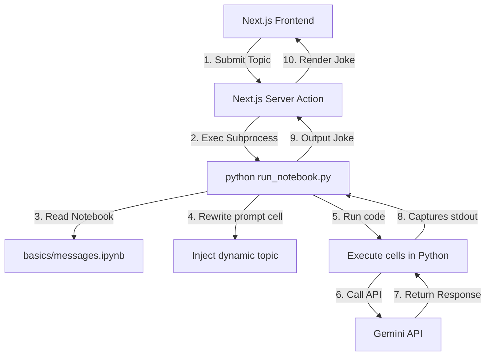

# Jupyter Joke Agent (LangChain + Next.js)

A premium, interactive web application that connects a modern React/Next.js frontend directly with Jupyter Notebook code pipelines using LangChain and Google Gemini models.

This application allows you to type any topic, dynamically runs a Python script that parses, modifies, and runs code cells from a Jupyter Notebook, and generates custom AI jokes.

---

## 🚀 Features

- **Jupyter Notebook Integration**: Directly executes and parses `.ipynb` notebooks dynamically on demand.
- **Dynamic Variable Injection**: Rewrites prompt variables (like the joke topic) in the notebook cells on-the-fly before execution.
- **LangChain & Gemini**: Uses LangChain (`ChatGoogleGenerativeAI`) and the latest Gemini models (`gemini-2.5-flash`) via `SystemMessage` and `HumanMessage`.
- **Beautiful Glassmorphism UI**: High-end Next.js/Tailwind UI with dark mode gradients, micro-animations, loading indicators, clipboard copying, and sample topic presets.
- **Secure API Key Handling**: Integrates seamlessly with `.env` files (properly git-ignored) for local development.

---

## 🛠️ Tech Stack

- **Frontend**: Next.js (App Router), React, Tailwind CSS, TypeScript
- **Backend / Notebook Execution**: Python 3.x, Jupyter (`ipykernel`), LangChain (`langchain-core`, `langchain-google-genai`), Python dotenv
- **Orchestration**: `run_notebook.py` CLI utility

---

## 📐 Architecture Flow



---

## 📦 Project Structure

```
├── basics/
│   ├── basics.ipynb        # Basic single-string invoke notebook
│   └── messages.ipynb      # Advanced notebook utilizing Chat Messages
├── frontend/
│   ├── app/
│   │   ├── actions.ts      # Server Action calling python script
│   │   ├── page.tsx        # Main UI for Joke generation
│   │   └── globals.css     # Tailwind styling
│   └── package.json
├── .env                    # Local environment variables (API keys - Git ignored)
├── .gitignore              # Git ignore rules (configured to ignore .env and .venv)
├── pyproject.toml          # Python dependencies declaration
├── run_notebook.py         # Notebook parser and runner utility
└── uv.lock                 # UV Package lockfile
```

---

## ⚙️ Setup and Installation

### Prerequisites
- Python 3.10+ installed
- Node.js 18+ installed

### Step 1: Set up the Python Environment
1. Create a virtual environment and install the required dependencies:
   ```bash
   python -m venv .venv
   .venv\Scripts\activate   # On Windows
   # source .venv/bin/activate # On Unix/macOS
   pip install -r pyproject.toml
   ```
   *(Or if you use `uv`: `uv sync`)*

### Step 2: Configure Environment Variables
Create a `.env` file in the root directory and add your Google Gemini API key:
```env
GOOGLE_API_KEY="your-gemini-api-key-here"
```

### Step 3: Run the Frontend
1. Navigate to the frontend directory:
   ```bash
   cd frontend
   ```
2. Install npm packages:
   ```bash
   npm install
   ```
3. Start the Next.js development server:
   ```bash
   npm run dev
   ```
4. Open [http://localhost:3000](http://localhost:3000) in your browser to experience the Jupyter Joke Agent!

---

## ⚡ CLI Usage
You can also run the notebook runner directly via the terminal:
```bash
python run_notebook.py "your topic"
```
Example:
```bash
python run_notebook.py "software engineering"
```
